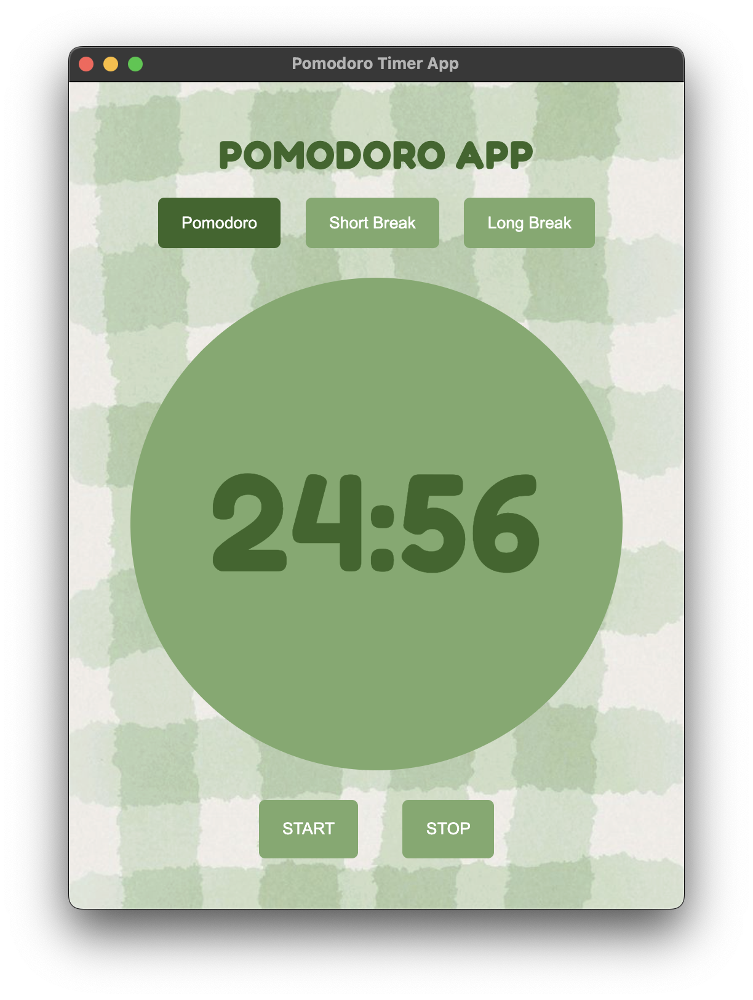

# Pomodoro Timer App
a simple cute pomodoro app

I made this app since i wanted to make an app using electron. tbh it was fairly simple since i used vanilla html/css/js for coding out the app. 

## Features
- start/stop buttons
- select session time/short break/long break function
- is a native desktop app, with builds for mac and windows

## Screemshot

## Credits
- made by me
- background img: [pinterest pin](https://in.pinterest.com/pin/1008595279035492543/)
- font: [fredoka - google fonts](https://fonts.google.com/specimen/Fredoka)
- app icon: [magnific](https://www.magnific.com/icon/pomodoro-technique_12238217#fromView=keyword&page=1&position=16&uuid=ee785a4f-4085-4c0b-bc00-76640cf787ef&log-in=email)
- AI HELP: for setting up electron + configuiring files for the electron build
